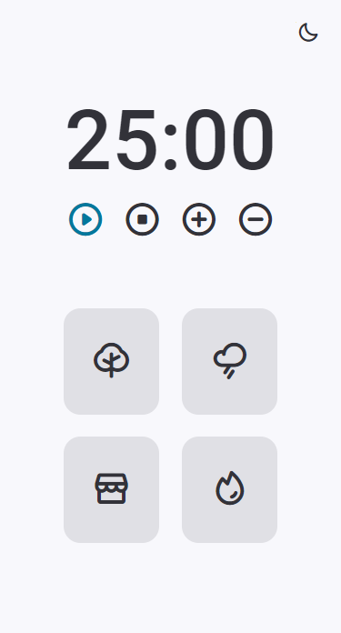

# Stage 05 - Challenge 02

## ⚔️ **Desafio - Focus Timer**

### Focus Timer é um tempororizador regressivo para utilização do Método Pomodoro - técnica de gerênciamento tempo para o desenvolvimento de tarefas.

 

## 🔨 **Fucionalidades**

---

- Modo claro e modo escuro;

- Contador regressivo de até 25 minutos;

- Incremento e decremento de 05 minutos;

- Sons ambientes para concetração: floresta, chuva, cafeteria e lareira;

 

## 📝 **Conceitos trabalhados**

---

**HTML e CSS**

- Estrutura HTML;
- Resposividade;
- Posicionamento, alinhamento e estilização dos elementos;

**Java Script**

- Minupulação da DOM;
- Funções callback;
- ES6 modules;

 

### 👉🏽 Clique **[aqui](https://eduardofariasdev.github.io/stage05-fortune-cookie/)** e abra esse projeto no seu seu navegador.

 

🚀 **Projeto desenvolvido no programa de formação Explorer da Rocketseat.**
